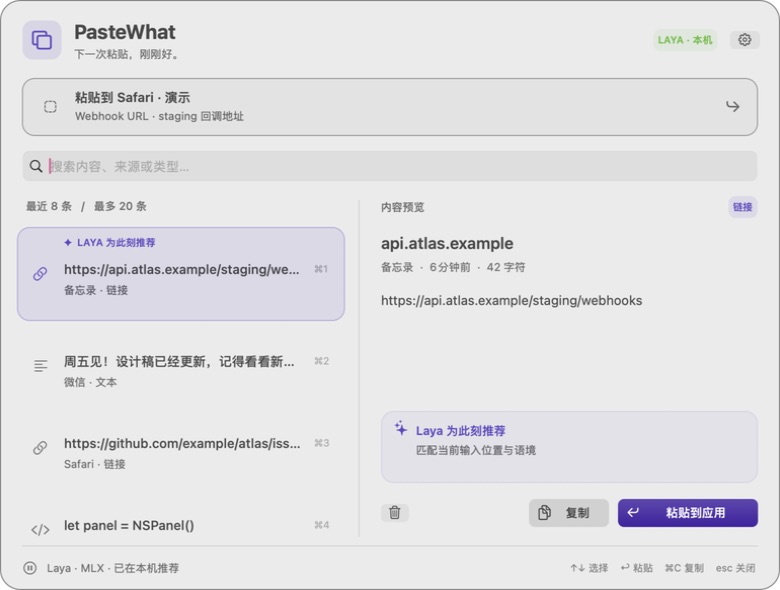

# PasteWhat

**下一次粘贴，刚刚好。**

一个纯 AppKit 界面的 macOS 菜单栏剪贴板工具。结合当前应用、输入框语境与本地 **Laya** 模型，从最近 20 条记录中推荐此刻需要的内容，并放在首位。

Native AppKit clipboard history with contextual, on-device Laya recommendations.

<picture>
  <source media="(prefers-color-scheme: dark)" srcset="docs/assets/pastewhat-dark.jpg">
  
</picture>

截图使用隔离的合成演示内容，推荐由真实本地模型产生。

## 可以做什么

- 常驻菜单栏，`⌥⇧V` 打开；快捷键可更换。
- 记录最近 **20 条不同的复制内容**，重复内容更新到最新位置。
- 支持文本、链接、邮箱、代码、命令、颜色、PNG/TIFF、文件 URL 和常见富文本表示。多文件复制作为一条记录保留；单条所有表示合计最多 8 MiB。
- 打开时锁定目标应用，再读取可用的聚焦输入框语境；不抓屏。
- 后台先预筛候选，Laya 推荐项置首；前端仍保留完整历史，其余记录维持复制时间顺序。开始选择后，异步推荐不会换掉选中的条目。
- 搜索内容、来源和类型；查看文字或图片预览；复制原格式或纯文本，粘贴回原应用。
- 浅色、深色、跟随系统；可暂停记录、删除记录、清空历史、关闭磁盘保存和启用登录启动。

推荐只改变面板顺序。**选择复制或粘贴后才会修改系统剪贴板。** 历史从应用运行期间开始积累，无法取回 macOS 从未保存的过去 20 次复制。

## 构建与运行

需要 Apple silicon Mac、macOS 14+、带 Swift 6 的 Xcode 16.3+。可选 Core ML 后端需要 macOS 15+。当前在 M3 Max、macOS 27.2、Xcode 27.0 上完成构建与运行验证。

```bash
git clone https://github.com/mizorewww/pastewhat.git
cd pastewhat
./scripts/build-app.sh
open dist/PasteWhat.app
```

生成 `dist/PasteWhat.app`，默认进行本地 ad-hoc 签名。可用 `./scripts/build-app.sh debug` 构建调试版，也可以在 Xcode 中打开 `Package.swift`。长期使用请启动 `.app`，以获得稳定的菜单栏、权限和登录启动行为。

### 本地 Laya 引擎

界面和系统集成都由 Swift/AppKit 实现；推理由一个**常驻 Python worker** 复用已验证的 Laya runtime。模型只加载一次，同一语境会复用类型推理结果。

如果本项目与 `laya-mlx` 位于同一父目录，应用会自动发现其 `.venv/bin/python` 和 `models/hub/laya-multilingual-mlx`。也可在设置中选择已有 Python 和模型。

独立安装需要 [uv](https://docs.astral.sh/uv/getting-started/installation/)：

```bash
# 默认 MLX：创建 Python 3.12 环境、安装 runtime、下载 multilingual 模型
./scripts/setup-engine.sh

# 已有权重，跳过下载
./scripts/setup-engine.sh --model /absolute/path/to/laya-multilingual-mlx

# 复用 sibling 项目，既不安装也不修改 sibling
./scripts/setup-engine.sh --use-sibling

# 可选通用 Core ML multilingual（CPU + GPU）
./scripts/setup-engine.sh --backend coreml
```

安装配置位于 `~/Library/Application Support/PasteWhat/engine.json`。安装后重新启动应用；在设置中修改路径后点击“保存并重新连接”即可。模型不包含在 Git 仓库或 `.app` 中。首次下载约数百 MB；常规推荐强制离线运行，不上传剪贴板或语境。

Core ML 请使用通用 `laya-multilingual-coreml`，不能使用 96-token 的 ANE 模型。它的短请求速度数据不适用于这个产品的上下文任务。更多说明见 [引擎文档](docs/ENGINE.md)。

### 系统权限

辅助功能权限用于读取聚焦输入框和自动发送粘贴快捷键。点击应用设置中的“开启辅助功能…”，在系统设置里允许 PasteWhat；重新打开面板即可检测。没有权限时仍能记录允许读取的剪贴板、浏览历史、搜索和复制，然后手动 `⌘V`。只有应用类别而没有有效输入语境时，保留时间顺序。

macOS 15.4+ 还可能单独询问剪贴板读取权限。持续记录需要允许 PasteWhat 访问剪贴板；拒绝时底栏会显示原因。应用不需要屏幕录制权限。开发时重新签名可能需要系统重新确认辅助功能权限。

## 操作

| 操作 | 快捷键 / 入口 |
|---|---|
| 打开或关闭面板 | `⌥⇧V`，或点击菜单栏图标 |
| 选择记录 | `↑` / `↓` |
| 粘贴所选记录 | `↩`，或双击记录 |
| 复制所选记录 | `⌘C` / `⌘↩` |
| 复制纯文本 | `⌘⇧C` / `⌘⇧↩` |
| 粘贴前九条中的指定记录 | `⌘1` … `⌘9` |
| 搜索 | 直接输入，或 `⌘F` |
| 删除记录 | 垃圾桶按钮；列表聚焦时可 `⌘⌫` |
| 关闭面板 | `Esc`，或点击外部 |
| 设置 | 齿轮 / `⌘,` |
| 暂停、退出 | 右键菜单栏图标 |

文字选区的 `⌘C` 保留正常复制行为，搜索框的 `⌘⌫` 保留正常文字编辑行为。输入法有未确认文字时，回车和方向键优先交给输入法。

## 推荐如何工作

Laya 是结构化决策模型，不生成粘贴内容。Swift 先把真实应用映射为浏览器、开发工具、终端、邮件等类别；模型请求中不包含应用名称、bundle ID、PID 或完整窗口标题。输入框和光标附近的语境优先于应用类别，真实应用信息保留在界面与粘贴目标校验中。

后台根据格式能力、明确字段约束、实体和文字匹配预筛候选，保留命令参数、否定条件与内容结构。候选数量自适应；证据不足时可保留全部 20 条。再结合 Laya 的类型和按需语义判断排序。新近度只用于同分时排序，不能单独构成推荐依据；没有明确答案或多个候选接近时不强行置顶。前端列表、搜索和手动粘贴始终覆盖完整历史。

模型概率不作为“推荐正确率”展示。早期 4 个样例仅用于探索，现有独立合成数据、冻结哈希、真实模型对照和无模型消融见 [推荐评估](evaluations/README.md)。合成评估不能替代真实用户使用效果。

模型未就绪时明确显示本地匹配或按时间排列。安全输入框会暂停语境推荐；原应用退出、焦点切换或剪贴板在操作期间变化时会取消自动粘贴，避免粘贴到错误的地方。

## 本地数据

历史保存在 `~/Library/Application Support/PasteWhat/history.json`，目录权限 `0700`、文件权限 `0600`，原子替换；退出前等待保存完成。它是本地文件保存，并非加密保险箱。关闭“在本机保留最近 20 条记录”会删除磁盘历史，当前会话仍可使用内存记录。

应用跳过带 concealed/transient/autogenerated 标记的内容和已知密码管理器来源。不应把这种尽力排除视为对所有敏感内容的保证。原始内容和格式用于粘贴，推荐只使用有界摘要和当前输入语境。

## 验证与开发约定

先查文档和 sibling 实现，再记录 [设计决策](docs/DESIGN.md)，不做 TDD。实现稳定后进行构建、真实模型、协议、存储和界面验证；临时验证脚手架均删除，没有测试 target 或合成测试数据混入真实历史。

[验证记录](docs/VALIDATION.md) 包含环境、实际完成的检查和未覆盖的范围。界面可独立演示：

```bash
open -n dist/PasteWhat.app --args --demo
```

演示不读取、保存或删除真实历史，但用户主动点击复制会复制示例内容。正常启动不填充任何示例。

本地构建包尚未作为公证发行版发布。需要固定签名身份时，可通过 `PASTEWHAT_SIGNING_IDENTITY` 环境变量传给构建脚本；正式对外分发还需要单独完成签名、公证及 runtime 打包。

模型和 runtime 来源见 [NOTICE](NOTICE)。
